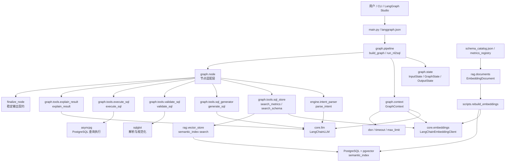
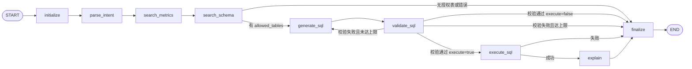
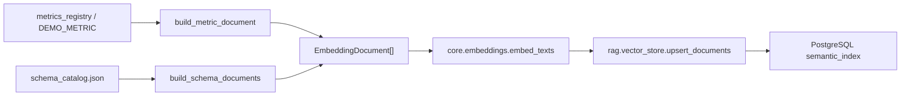

# NL2SQL 项目架构与精读指南

本文用于快速建立项目全局模型，并作为后续精读代码的路线图。

## 项目一句话

这是一个面向多租户 BI 场景的 NL2SQL 工作流。用户输入自然语言问题后，系统用 LangGraph 编排意图解析、指标检索、Schema 检索、SQL 生成、SQL 安全校验、可选执行和结果解释。

核心入口：

- CLI 入口：`main.py`
- LangGraph Studio 入口：`langgraph.json` -> `graph/pipeline.py:graph`
- 程序化入口：`graph.pipeline.run_nl2sql`
- 离线向量索引入口：`scripts/rebuild_embeddings.py`

## 总体架构



## 主执行链路

`graph/pipeline.py` 定义了固定节点顺序和条件路由：



这个图的实现点：

- `build_graph()` 注册所有节点和条件边。
- `run_nl2sql()` 创建 `GraphContext`，把 LLM、Embeddings、数据库参数作为 runtime context 注入。
- `graph.state.GraphState` 只保存业务状态，不保存模型对象或数据库连接。
- `graph.router` 只做确定性路由：Schema 是否有授权表、SQL 校验是否通过、执行是否成功。

## 分层职责

| 层 | 目录/文件 | 职责 |
| --- | --- | --- |
| 入口层 | `main.py`, `langgraph.json` | CLI、REPL、LangGraph Studio 图暴露 |
| 编排层 | `graph/pipeline.py`, `graph/node.py`, `graph/router.py`, `graph/state.py`, `graph/context.py` | 工作流编排、状态契约、运行时依赖注入、错误和 trace |
| 语义理解层 | `engine/intent_parser.py`, `engine/models.py` | 把自然语言解析为指标、时间范围、维度、过滤条件 |
| RAG 检索层 | `graph/tools/sql_store.py`, `rag/vector_store.py`, `rag/documents.py` | 问题向量化，检索 metric/table/column 语义文档 |
| SQL 工具层 | `graph/tools/sql_generator.py`, `graph/tools/validate_sql.py`, `graph/tools/execute_sql.py`, `graph/tools/explain_result.py` | SQL 生成、校验、执行、结果解释 |
| 模型适配层 | `core/llm.py`, `core/embeddings.py`, `core/structured_output.py` | LangChain 模型封装、环境变量工厂、结构化输出解析 |
| 目录资产层 | `catalog/*`, `schema_catalog.json`, `db/table_comment.sql` | Schema/Metric 资产来源和格式化 |
| 离线维护层 | `scripts/rebuild_embeddings.py` | 重建 semantic_index 的 embedding 文档 |
| 测试层 | `tests/*` | 约束图状态、路由、节点、工具和 CLI 行为 |

`evals/`、`monitor/`、`security/` 目前没有文件，更像是预留目录。

## 关键数据契约

### 输入与输出

`InputState` 只有三个公开字段：

- `question`
- `tenant_id`
- `execute`

`OutputState` 是稳定 API：

- `ok`
- `question`
- `tenant_id`
- `intent`
- `sql`
- `rows`
- `answer`
- `error`
- `trace`

### GraphState 的核心中间状态

- `intent`：`QueryIntent`，来自意图解析。
- `metrics_result`：指标检索结果，来自 `semantic_index` 中的 `metric` 文档。
- `table_names`：从 metric 的 `base_table` 和 `join_tables` 推导出的候选表。
- `schema_result`：Schema 检索结果，来自 `table` / `column` 文档。
- `allowed_tables`：最终授权表集合，SQL 校验必须使用它。
- `candidate_sql`：模型生成的原始 SQL。
- `validation_result` / `validated_sql`：sqlglot 校验和规范化后的结果。
- `retry_feedback`：校验失败时反馈给下一轮 SQL 生成的错误上下文。
- `execution_result` / `rows` / `answer`：执行和解释阶段产物。
- `trace`：每个节点的成功/失败记录。

## 安全边界

当前安全策略主要在 `graph/tools/validate_sql.py` 和 `graph/node.py` 中实现：

- Schema 检索必须返回非空 `allowed_tables`，否则在 `search_schema_node` 处终止。
- SQL 必须是单条 PostgreSQL 查询。
- 禁止 DDL/DML/mutation 语句。
- SQL 中所有表必须在 `allowed_tables` 中。
- 没有 `LIMIT` 时自动添加 `LIMIT max_limit`。
- 超过 `max_limit` 的 `LIMIT` 会被降到上限。
- 执行前会再次调用 `validate_sql()`。
- 执行时设置 PostgreSQL `statement_timeout`。

需要特别留意：当前校验是表级 allowlist，不会自动把 `tenant_id = ...` 注入 SQL，也不会强制检查每张表都有租户过滤。多租户行级隔离需要依赖指标定义、Prompt 约束、数据库 RLS，或后续增强校验器。

## 离线索引链路

运行时检索依赖 PostgreSQL 表 `semantic_index`。它不是从 `schema_catalog.json` 直接检索，而是先通过离线脚本构建 embedding：



精读这条链时重点看：

- `catalog.metrics.MetricRegistry.default()` 如何加载指标。
- `rag.documents` 如何把 metric/table/column 转为 `content + metadata`。
- `scripts.rebuild_embeddings.rebuild()` 如何分批生成 embedding 并 upsert。
- `rag.vector_store.search_semantic_index()` 如何按 `tenant_id` 和 `object_type` 过滤。

## 精读路线

### 第一遍：跑通“它是什么”

1. `README.md`
   先看项目目标、运行方式、工作流描述。当前 README 在部分终端中可能显示编码错乱，建议用 UTF-8 编辑器打开。

2. `pyproject.toml`
   看技术栈：Python 3.12、LangChain、LangGraph、Google GenAI、OpenAI-compatible DeepSeek、PostgreSQL、pgvector、sqlglot。

3. `main.py`
   看 CLI 如何调用 `run_nl2sql()`，以及 `execute=false/true` 对输出的影响。

4. `langgraph.json`
   看 LangGraph Studio 如何定位 `graph/pipeline.py:graph`。

### 第二遍：读懂工作流骨架

1. `graph/state.py`
   先掌握输入、输出、中间状态。这个文件定义了整个系统的数据总线。

2. `graph/context.py`
   看 runtime-only 依赖如何被隔离到 `GraphContext`。

3. `graph/router.py`
   看三个关键条件路由：Schema 后、Validate 后、Execute 后。

4. `graph/pipeline.py`
   从 `build_graph()` 开始逐边阅读，再看 `run_nl2sql()` 如何设置 recursion limit 和 context。

### 第三遍：逐节点读执行细节

1. `graph/node.py`
   这是最值得精读的文件。建议按节点函数顺序读：
   `initialize_node` -> `parse_intent_node` -> `search_metrics_node` -> `search_schema_node` -> `generate_sql_node` -> `validate_sql_node` -> `execute_sql_node` -> `explain_node` -> `finalize_node`。

2. 重点辅助函数：
   - `_trace()`：统一记录节点执行轨迹。
   - `_error()`：把异常转成终止状态。
   - `_metric_table_names()`：从指标定义中推导 Schema 搜索范围。
   - `_retry_feedback()`：把 SQL 校验错误反馈给下一轮生成。

### 第四遍：读模型与 Prompt

1. `engine/intent_parser.py`
   看系统提示词如何使用本地日期处理“今天、昨天、本月”等相对时间。

2. `engine/models.py`
   看 `QueryIntent` 的字段与容错转换。

3. `graph/tools/sql_generator.py`
   看 SQL 生成系统提示词、metric/schema 上下文格式化，以及 `_extract_sql()` 如何清洗模型输出。

4. `core/structured_output.py`
   看模型 JSON 输出的提取规则：裸 JSON、fenced JSON、`<o>...</o>`。

### 第五遍：读 RAG 和数据资产

1. `graph/tools/sql_store.py`
   看 `search_metrics()` 和 `search_schema()` 如何调用 embedding 与向量检索。

2. `rag/vector_store.py`
   看连接 PostgreSQL、注册 pgvector codec、upsert 和 nearest-neighbor 查询。

3. `rag/documents.py`
   看 metric/table/column 文档如何被构造，metadata 如何供 SQL 生成使用。

4. `catalog/metrics.py`, `catalog/loader.py`, `catalog/schema_catalog.py`
   看指标和 schema 资产如何来自数据库或 JSON。

5. `scripts/rebuild_embeddings.py`
   看离线重建索引命令的参数、批处理和 dry-run 行为。

### 第六遍：读 SQL 安全闭环

1. `graph/tools/validate_sql.py`
   看 sqlglot 解析、危险表达式过滤、表级授权和 LIMIT 规范化。

2. `graph/tools/execute_sql.py`
   看执行前二次校验、DSN 读取、statement timeout 和 asyncpg 查询。

3. `graph/tools/explain_result.py`
   看执行结果如何被限制为前 10 行 preview，再交给 LLM 生成解释。

### 第七遍：用测试反推设计意图

建议按这个顺序读测试：

1. `tests/test_graph_state.py`
2. `tests/test_graph_routing.py`
3. `tests/test_graph_nodes.py`
4. `tests/test_graph_pipeline.py`
5. `tests/test_graph_tools.py`
6. `tests/test_sql_generator.py`
7. `tests/test_sql_store.py`
8. `tests/test_rag_documents.py`
9. `tests/test_vector_store.py`
10. `tests/test_main_cli.py`

这些测试覆盖了状态契约、路由、节点级错误处理、重试机制、SQL 安全校验、向量索引接口和 CLI 输出。

## 本地验证基线

使用 Conda 环境：

```powershell
D:\Env\miniconda3\envs\agents-env\python.exe -m unittest discover -s tests -v
```

当前基线：

- Python: 3.12.13
- 测试结果：32 个测试全部通过

## 后续精读建议

如果要继续深入，我建议下一步从 `graph/node.py` 开始做逐函数精读。它连接了所有层，是理解这个项目的最短路径。读完它之后，再展开到 `graph/tools/sql_store.py` 和 `graph/tools/validate_sql.py`，分别覆盖 RAG 检索和安全边界。
