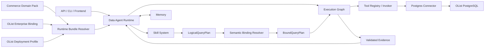

# Data Agent 平台架构设计

> **Historical / partially superseded:** Retained for governance and datasource platform decisions. Fixed Commerce/OList Pack composition was replaced by the 2026-08-08 native dataset Analysis Agent design.

**状态：** 已批准设计，待实施计划
**日期：** 2026-07-10
**迁移方式：** 一次性破坏性迁移，不保留旧 Python import、旧 `graph/engine` 目录或 Fixed/Dynamic 双轨兼容层

## 1. 目标

将当前面向 OList 的 NL2SQL Agent 重构为一个配置驱动的 Data Agent 平台内核。首期仅交付：

- 一个统一的 Data Agent Runtime；
- 一个只实现电商领域的 Skill System；
- 一个覆盖完整分析生命周期的类型化 Execution Graph；
- 一个契约驱动、策略统一、可审计的 Tool Registry；
- 一个分层、按作用域隔离、需要确认才能晋升的 Memory 系统；
- 一个只绑定 OList PostgreSQL 数据库的 Enterprise Data Binding；
- 一套从规范电商语义到 OList 物理库表字段的确定性映射；
- 一条以现有 48 条 OList 问题为核心的持续评测门禁。

最终产品的扩展路径必须满足：

```text
新增企业     → 新增 Enterprise Data Binding
新增领域     → 新增 Domain Pack 与领域 Skill
新增数据库   → 新增受信 Connector Provider
新增分析能力 → 新增 Workflow Skill 或 Graph Fragment
```

企业差异不能通过复制 Runtime、复制 Skill 或复制工具代码解决。

## 2. 已确认的架构决策

1. 使用统一 Runtime，不保留当前 Fixed/Dynamic 两条执行路径。
2. 模型只围绕规范领域语义生成 `LogicalQueryPlan`，不直接围绕 OList 物理表名规划。
3. 电商 Domain Pack 定义跨企业可复用的实体、关系、指标、术语和确定性规则。
4. OList Enterprise Data Binding 只定义 PostgreSQL 数据源、物理表字段映射和访问策略。
5. Domain Pack、Enterprise Binding 和权限策略是权威配置，不属于 Memory。
6. Skill 只引用规范语义和工具能力，不包含企业表名、凭据或任意可执行代码。
7. Execution Graph 是项目自己的公共中间表示；LangGraph 只作为执行后端。
8. 所有工具调用必须经过同一个 Registry/Invoker，从而统一输入输出校验、权限、超时、审计和脱敏。
9. Memory 采用 `propose → policy check → approval → commit`，禁止模型直接写共享记忆。
10. OList 的首期行为继续覆盖现有电商问题集，但不要求保留旧模块名、旧类名或内部状态结构。

## 3. 设计依据

OpenAI 的内部数据智能体文章强调了以下原则：

- 高质量数据分析依赖表使用情况、人工注释、代码增强、机构知识、记忆和运行时检查组成的多层上下文；
- Agent 应完成从发现数据、运行查询到汇总结果的端到端分析，并根据中间结果进行有界自我修正；
- 重复分析应封装成可复用工作流；
- 工具应该少而清晰，避免功能重叠；
- 权限应从已有数据平台透传，结果需要透明、可验证；
- 评测应同时关注 SQL 语义和结果数据，而不是只比较 SQL 字符串。

来源：<https://openai.com/zh-Hans-CN/index/inside-our-in-house-data-agent/>

本设计将这些原则工程化为五个核心模块和两类配置包，但不假设或复制 OpenAI 未公开的内部源码结构。

## 4. 范围

### 4.1 首期包含

- PostgreSQL OList 数据源；
- `commerce` Domain Pack；
- `olist` Enterprise Data Binding；
- 一个通用的 `commerce.analytics` Skill；
- 聚合、趋势、多维分析和明细查询；
- SQL 只读执行、租户/卖家范围限制、行数与超时限制；
- 会话上下文、用户偏好、已批准企业记忆和运行检查点；
- API、CLI 和前端继续作为 Runtime 的适配器；
- OList 48 条评测问题及其预期指标、语义和数据结果。

### 4.2 首期不包含

- 工厂进销存与财务 Domain Pack；
- OList 之外的企业 Binding；
- MySQL、SQL Server、Oracle 或跨数据源联邦查询；
- 任意第三方 Skill 热加载或不受信 Python 插件；
- 写库、修改报表、发送邮件等有副作用工具；
- 任意 SQL、Jinja、shell 或 Python 表达式写入配置；
- 自动推断并直接发布企业字段映射；
- 复杂 ETL 逻辑在 YAML 中表达；
- 前端视觉重设计。

复杂数据转换必须通过受治理的 PostgreSQL 只读视图或后续的数据建模层提供，不能塞入 Enterprise Binding。

## 5. 总体架构



依赖方向必须保持单向：

```text
API / CLI / Frontend
        ↓
Data Agent Runtime
        ├──→ Skill System
        ├──→ Execution Graph Compiler
        ├──→ Memory Ports
        └──→ Profile / Context Resolver

Execution Graph Executor
        ├──→ ToolInvoker Port
        └──→ CheckpointStore Port

ToolInvoker Implementation
        → Tool Registry
        → Policy Engine
        → Connector Provider
        → OList PostgreSQL
```

禁止以下反向依赖：

- Skill 不依赖企业数据库或 Tool Handler；
- Tool Registry 不依赖 Skill 或业务 Planner；
- Memory 不依赖 Runtime、Skill 或 Tool；
- Execution Graph 不依赖具体 PostgreSQL 驱动；
- Domain Pack 不引用 OList 表名；
- Enterprise Binding 不定义新的 Skill 行为。

## 6. 目标目录结构

```text
src/
├── data_agent/
│   ├── runtime/
│   │   ├── service.py
│   │   ├── models.py
│   │   ├── context.py
│   │   ├── context_assembler.py
│   │   ├── profile_loader.py
│   │   ├── events.py
│   │   ├── errors.py
│   │   └── composition.py
│   │
│   ├── skills/
│   │   ├── contracts.py
│   │   ├── registry.py
│   │   ├── loader.py
│   │   └── commerce/
│   │       ├── manifest.py
│   │       ├── models.py
│   │       ├── planner.py
│   │       ├── validators.py
│   │       └── prompts.py
│   │
│   ├── execution/
│   │   ├── models.py
│   │   ├── compiler.py
│   │   ├── validator.py
│   │   ├── executor.py
│   │   ├── retry.py
│   │   ├── checkpoint.py
│   │   └── langgraph_backend.py
│   │
│   ├── tools/
│   │   ├── contracts.py
│   │   ├── registry.py
│   │   ├── invoker.py
│   │   ├── policy.py
│   │   ├── tracing.py
│   │   ├── manifest.py
│   │   ├── providers/
│   │   │   ├── semantic_search.py
│   │   │   ├── data_inspect.py
│   │   │   ├── query_compile.py
│   │   │   ├── query_execute.py
│   │   │   ├── result_profile.py
│   │   │   └── answer_render.py
│   │   └── connectors/
│   │       ├── contracts.py
│   │       └── postgres.py
│   │
│   └── memory/
│       ├── contracts.py
│       ├── models.py
│       ├── manager.py
│       ├── scopes.py
│       ├── checkpoint_store.py
│       └── providers/
│           ├── null.py
│           ├── postgres.py
│           └── graphiti.py
│
└── api/
    ├── app.py
    ├── routes.py
    ├── schemas.py
    ├── auth.py
    └── stores.py

packs/
├── schemas/v1/
├── domains/commerce/
│   ├── pack.yaml
│   ├── semantic-model.yaml
│   ├── metrics.yaml
│   ├── vocabulary.zh-CN.yaml
│   ├── policies.yaml
│   └── evals.yaml
├── enterprises/olist/
│   ├── pack.yaml
│   ├── sources.yaml
│   ├── bindings/commerce.yaml
│   ├── policies.yaml
│   ├── contract-tests.yaml
│   └── pack.lock
└── deployments/
    └── olist-local.yaml

frontend/
scripts/
evals/
tests/
```

Python 包切换为 `src/` layout。现有 `graph/`、`engine/`、`catalog/`、`rag/` 和 `core/` 中的逻辑按职责迁移后删除，不保留兼容 import。

## 7. 配置模型

### 7.1 Commerce Domain Pack

Domain Pack 只表达规范电商语义，不包含任何 OList 物理名称。

首期规范实体：

| 规范实体 | 粒度 | OList 首期用途 |
| --- | --- | --- |
| `commerce.Order` | 每个订单一行 | 状态、购买/发货/送达时间、客户 |
| `commerce.OrderItem` | 每个订单商品项一行 | 商品、卖家、价格、运费 |
| `commerce.Customer` | 每个客户一行 | 城市、州、邮编 |
| `commerce.Seller` | 每个卖家一行 | 城市、州、租户范围 |
| `commerce.Product` | 每个商品一行 | 品类、重量、尺寸 |
| `commerce.Payment` | 每笔支付记录一行 | 方式、分期、序号、金额 |
| `commerce.Review` | 每条评价一行 | 评分、标题、内容、时间 |
| `commerce.GeoLocation` | 每个邮编地理记录一行 | 经纬度和位置覆盖 |
| `commerce.CategoryTranslation` | 每个品类翻译一行 | 葡语与英语品类映射 |

首期核心指标严格保持现有 OList 评测语义：

```text
commerce.gmv
    = SUM(OrderItem.item_price + OrderItem.freight_amount)
    event_time = OrderItem.shipping_limit_at

commerce.order_count
    = COUNT(DISTINCT OrderItem.order_id)

commerce.average_item_price
    = AVG(OrderItem.item_price)

commerce.average_review_score
    = AVG(Review.score)
```

Domain Pack 还定义：

- 规范字段的逻辑类型、单位、可空性和时间语义；
- 实体关系及其基数；
- 中文、英文和业务同义词；
- 查询结果预期粒度；
- 多对多连接、重复加权、空值和时间范围等确定性校验；
- 48 条 OList 问题对应的领域级预期，而不是物理 SQL 字符串。

### 7.2 OList Enterprise Data Binding

OList Binding 将规范实体绑定到以下物理表：

```text
commerce.Order               → olist_orders_dataset
commerce.OrderItem           → olist_order_items_dataset
commerce.Customer            → olist_customers_dataset
commerce.Seller              → olist_sellers_dataset
commerce.Product             → olist_products_dataset
commerce.Payment             → olist_order_payments_dataset
commerce.Review              → olist_order_reviews_dataset
commerce.GeoLocation         → olist_geolocation_dataset
commerce.CategoryTranslation → product_category_name_translation
```

示例：

```yaml
apiVersion: dataagent.io/enterprise/v1
kind: EnterpriseDataBinding

metadata:
  name: olist
  version: 1.0.0

spec:
  domains:
    - ref: commerce@1.0.0

  sources:
    sales:
      connector: postgres
      connectionRef: secret://olist/local/database
      readOnly: true

  bindings:
    commerce.OrderItem:
      source: sales
      relation: public.olist_order_items_dataset
      grain: [order_id, order_item_id]
      fields:
        order_id: {column: order_id}
        product_id: {column: product_id}
        seller_id: {column: seller_id}
        item_price: {column: price, cast: decimal}
        freight_amount: {column: freight_value, cast: decimal}
        shipping_limit_at:
          column: shipping_limit_date
          timezone: America/Sao_Paulo

  policies:
    tenantScope:
      mode: seller_id
      canonicalField: commerce.OrderItem.seller_id
      principalClaim: tenant_id
    maxRows: 1000
    queryTimeoutSeconds: 10
```

Binding 中允许：

- 数据源、schema、表和字段映射；
- 主键、关系键和关系基数；
- 简单类型转换、时区、空值策略和枚举映射；
- 从白名单操作符组成的简单表达式 AST；
- 行列权限引用、资源 allowlist 和查询上限。

Binding 中禁止：

- 任意 SQL 字符串；
- Python、Jinja、shell 或 import path；
- 任意网络、文件或写库行为；
- 绕过 Domain Pack 类型、粒度或指标定义；
- 放宽平台或 Domain Pack 已有的安全策略。

### 7.3 Deployment Profile

首期只提供 `olist-local` Profile：

```yaml
apiVersion: dataagent.io/deployment/v1
kind: DeploymentProfile

metadata:
  name: olist-local

spec:
  enterprisePack: olist@1.0.0
  environment: local
  secretsProvider: environment
  datasourceSecrets:
    secret://olist/local/database: DATABASE_URL
  memoryDatabaseRef: MEMORY_DATABASE_URL
  runtime:
    maxToolCalls: 24
    maxCorrectionRounds: 2
    maxDurationSeconds: 120
```

配置只保存 Secret 引用，不保存明文凭据。

### 7.4 Resolved Runtime Bundle

原始 YAML 不能在每次请求中临时解释。发布流程必须编译出不可变快照：

```text
ResolvedRuntimeBundle
- runtime_version
- domain_pack_digest
- enterprise_binding_digest
- deployment_profile_digest
- skill_versions
- tool_registry_version
- semantic_model
- physical_bindings
- connector_capabilities
- compiled_access_policy
- schema_fingerprint
```

Runtime 按 digest 原子加载。一次请求执行期间不允许热切换配置版本。

## 8. Data Agent Runtime

Runtime 是所有入口的唯一应用服务。

核心接口：

```python
class DataAgentRuntime(Protocol):
    async def run(
        self,
        request: AgentRequest,
        principal: PrincipalContext,
    ) -> AsyncIterator[AgentEvent]: ...
```

核心请求模型：

```text
AgentRequest
- question
- enterprise_id = "olist"
- domain_id = "commerce"
- conversation_id
- mode = "plan" | "preview" | "execute"
- requested_output
```

运行流程：

1. 验证身份，建立 `PrincipalContext`；
2. 固化运行预算与 deadline；
3. 加载 `ResolvedRuntimeBundle`；
4. 根据身份过滤可访问的规范资源；
5. 召回会话和已批准 Memory；
6. 组装类型化 `ContextEnvelope`；
7. 选择 `commerce.analytics` Skill；
8. 生成并校验 `LogicalQueryPlan`；
9. 通过 OList Binding 得到 `BoundQueryPlan`；
10. 编译并执行 Execution Graph；
11. 汇总经过验证的结果、假设、数据时点和 lineage；
12. 生成 Memory 候选和评测事件；
13. 持久化脱敏 trace 与 checkpoint；
14. 输出 `AgentResponse`。

Runtime 管理：

- 请求流式事件；
- 超时、取消和幂等；
- token、工具次数、SQL 修复次数和成本预算；
- 配置、Skill、Graph、Tool、模型版本；
- 错误分类和安全输出；
- 长运行任务的 checkpoint/resume。

Runtime 不负责：

- 定义 GMV 或领域实体；
- 保存物理字段映射；
- 实现 SQL 方言或数据库驱动；
- 自动写入企业共享 Memory。

## 9. Context Envelope

Runtime 使用统一 `ContextEnvelope`，替代当前散落在大字典中的上下文：

```text
ContextEnvelope
- principal_context
- domain_semantic_context
- enterprise_binding_context
- skill_context
- approved_memory_context
- conversation_context
- execution_evidence
```

每条 Context Item 必须包含：

```text
source
version
trust_level
sensitivity
token_cost
valid_from / expires_at
```

不可跨越的优先级：

```text
Security Context
> Domain Pack 硬规则
> Enterprise Binding
> Skill 约束
> 已批准企业 Memory
> 用户 Memory
> 会话 Memory
> 执行中的临时推断
```

低优先级上下文不能覆盖高优先级配置。Context Assembler 应按预算检索最相关内容，不能把全部 Schema、历史或 Memory 无差别塞入 Prompt。

## 10. Skill System

首期只注册一个 Skill：

```text
skill_id: commerce.analytics
version: 1.0.0
domain: commerce
```

该 Skill 覆盖：

- 单指标分析；
- 多指标分析；
- 多维分组；
- 时间趋势与同比/环比；
- Top-N 排名；
- 明细记录查询；
- 支付、评价、商品、卖家、客户和物流分析；
- 需要 CTE、窗口函数或多表关系的复杂问题。

SkillManifest：

```text
skill_id / version / domain
intent_signatures
required_semantic_ids
required_tool_capabilities
allowed_tools
graph_fragment
logical_plan_schema
validators
output_schema
memory_write_policy
eval_suite_ref
```

Skill 输入：

```text
SkillInput
- question
- contextualized_question
- commerce_semantic_snapshot
- accessible_semantic_resources
- approved_memories
- conversation_summary
```

Skill 输出：

```text
LogicalQueryPlan
- analysis_type
- metrics
- dimensions
- filters
- time_range
- time_grain
- ordering
- limit
- expected_grain
- assumptions
- requested_evidence
```

`LogicalQueryPlan` 禁止包含：

- 物理数据库、schema、表或列名；
- 原始 SQL；
- Connector 名称或凭据；
- 未在 Domain Pack 中声明的指标或字段。

Skill 的确定性验证器负责检查：

- 指标、维度、过滤字段是否存在；
- 实体关系是否可达；
- 指标粒度与分组粒度是否兼容；
- 连接是否可能造成重复加权；
- 时间范围、排序和 limit 是否完整；
- 结果形态是否符合用户问题。

Skill 首期采用内置、版本化、受信实现。外部 Skill 包发现、热更新和任意代码插件不在首期范围。

## 11. Semantic Binding 与 Query 编译

绑定流程：

```text
LogicalQueryPlan
→ Semantic Validator
→ Binding Resolver
→ BoundQueryPlan
→ SQL AST Compiler
→ Policy Rewriter
→ PreparedQuery
```

类型化产物：

```text
BoundQueryPlan
- physical_relations
- selected_columns
- joins
- predicates
- aggregations
- grouping
- ordering
- limit
- lineage
- required_access

PreparedQuery
- dialect
- logical_plan_hash
- sql_ast_hash
- logical_sql
- executable_sql
- parameters
- allowed_relations
- policy_decision_id
- estimated_cost
```

租户策略在 SQL AST/Bound Plan 层确定性注入，而不是依赖 Prompt。OList 非管理员租户的 `tenant_id` 映射为 `seller_id`，所有可达实体必须通过 OrderItem 的卖家所有权关系收窄；管理员身份才允许全局访问。

## 12. Execution Graph

项目只保留一种完整 Execution Graph：

```text
resolve_context
→ recall_memory
→ contextualize_question
→ select_skill
→ build_logical_plan
→ validate_logical_plan
→ bind_physical_data
→ compile_query
→ validate_query
→ explain_cost
→ execute_preview
→ validate_preview
→ execute_query
→ validate_result
→ render_answer
→ propose_memory
→ evaluate_run
→ finalize
```

`mode` 决定查询阶段的条件边：

- `plan`：在 `validate_query` 后返回 Logical/Bound Plan 和 PreparedQuery，不访问业务数据；
- `preview`：运行 `query.execute(PREVIEW)`，通过 `validate_preview` 后直接生成答案；
- `execute`：先运行 PREVIEW，再使用同一 PreparedQuery 与 policy decision 执行正式只读查询，并由 `validate_result` 校验完整结果。

节点模型：

```text
NodeSpec
- id
- kind
- tool_ref
- input_bindings
- output_schema
- dependencies
- condition
- timeout
- retry_policy
- on_error
- approval_policy
```

Execution Graph 使用类型化 Artifact，不使用可由任意节点随意写入的全局 `dict`：

```text
LogicalQueryPlan
BoundQueryPlan
PreparedQuery
QueryPreview
QueryResult
ResultProfile
ValidatedEvidence
AnswerArtifact
MemoryProposal
```

### 12.1 有界纠错

错误按类型路由：

| 错误 | 处理 |
| --- | --- |
| `LOGICAL_PLAN_INVALID` | 返回 `build_logical_plan`，最多 2 次 |
| `BINDING_STALE` | 运行 `data.inspect`，刷新元数据后重绑；仍失败则终止 |
| `SQL_COMPILE_ERROR` | 返回 `compile_query`，最多 3 次 |
| `SQL_POLICY_VIOLATION` | 可修复时返回编译；权限类错误立即终止 |
| `COST_EXCEEDED` | 缩小时间窗/改用聚合，或请求用户确认 |
| `EMPTY_RESULT` | 检查时间、过滤和新鲜度，最多 1 次诊断 |
| `JOIN_EXPLOSION` | 返回 Logical Plan，重新选择关系路径 |
| `ACCESS_DENIED` | 立即终止，禁止扩大权限 |
| `RESULT_SEMANTIC_MISMATCH` | 返回 Logical Plan，最多 1 次 |

全局硬限制：

```text
max_correction_rounds = 2
max_sql_compile_attempts = 3
max_tool_calls = 24
max_duration_seconds = 120
max_result_rows = 1000
```

LangGraph 后端只实现 `compile/execute/resume`，不向 Skill 或 Tool 暴露 LangGraph 类型。

## 13. Tool Registry

核心接口：

```python
class ToolRegistry(Protocol):
    def register(self, spec: ToolSpec, provider: ToolProvider) -> None: ...
    def allowed_view(self, context: ExecutionContext) -> ToolRegistryView: ...

class ToolInvoker(Protocol):
    async def invoke(
        self,
        call: ToolCall,
        context: ExecutionContext,
    ) -> ToolResult: ...
```

`ToolSpec`：

```text
name / version
description
input_schema / output_schema
risk_level / side_effects
required_capabilities
idempotency
timeout
retry_policy
examples
eval_tags
```

`ToolResult`：

```text
status
typed_data / artifact_refs
structured_error
warnings
rows / cost / latency
lineage
policy_decision_id
redacted_trace
```

所有调用必须经过：

```text
Input Schema Validation
→ Skill Allowlist
→ Identity / Policy Check
→ Credential Broker
→ Tool Provider
→ Output Schema Validation
→ Audit / Trace
```

首期只注册以下稳定工具：

| 工具 | 作用 | 风险 |
| --- | --- | --- |
| `semantic.search` | 检索规范实体、指标、关系和相关注释 | low |
| `data.inspect` | 实时读取授权 Schema、新鲜度和安全统计 | medium/read |
| `query.compile` | 将 Bound Plan 编译为 PostgreSQL PreparedQuery | medium/none |
| `query.execute` | `EXPLAIN/PREVIEW/EXECUTE` 只读查询 | high/read |
| `result.profile` | 计算行数、空值、唯一性和异常统计 | low/none |
| `answer.render` | 基于已验证证据生成自然语言或表格答案 | low/none |

Memory 召回、写入候选和 checkpoint 是 Runtime 服务调用，不作为模型可见工具。

不得按企业、领域或物理表注册新工具。数据库差异由 Connector Provider 处理，业务差异由 Skill/Domain Pack 处理。

### 13.1 PostgreSQL Connector

首期唯一 Connector：

```python
class PostgresConnector:
    async def introspect_schema(...): ...
    async def explain(...): ...
    async def execute_readonly(...): ...
    def quote_identifier(...): ...
    def capabilities(...): ...
```

Connector 必须使用连接池，并对每次调用设置：

- 只读事务；
- `statement_timeout`；
- 最大结果行数；
- 允许 relation 集合；
- 用户/租户范围；
- 取消传播；
- 审计上下文。

## 14. Memory

Memory 分为：

| 类型 | 作用域 | 内容 |
| --- | --- | --- |
| Working Memory | run | Graph 状态、checkpoint、临时证据 |
| Conversation Memory | tenant/user/conversation | 会话摘要、最近分析上下文 |
| User Memory | tenant/user | 用户确认的展示或分析偏好 |
| Episodic Memory | tenant/domain | 成功计划模板、失败签名、纠错经验 |
| Approved Enterprise Memory | tenant/domain | 经审核的企业术语、口径和注意事项 |

Domain Pack、Enterprise Binding、Deployment Profile 和权限策略禁止存入 Memory。

核心接口：

```python
class MemoryManager(Protocol):
    async def recall(self, query: MemoryQuery, budget: MemoryBudget) -> MemoryBundle: ...
    async def propose(self, candidate: MemoryCandidate) -> ProposalId: ...
    async def commit(self, proposal_id: str, approval: ApprovalContext) -> None: ...
    async def invalidate(self, selector: MemorySelector) -> int: ...
    async def forget(self, subject: SubjectScope) -> int: ...
    async def save_checkpoint(self, run_id: str, state: Checkpoint) -> None: ...
```

Memory Record：

```text
tenant_id / domain_id
user_id / conversation_id
memory_type
structured_content
source / evidence
trust_level
approval_status
created_at / expires_at
domain_version / binding_version
sensitivity
```

写入流程：

```text
propose
→ deduplicate
→ conflict check
→ policy check
→ user/admin approval
→ commit
→ eval/review
```

默认禁止保存：

- 数据库密码和连接串；
- 完整查询结果集；
- 敏感字段原值；
- 未脱敏 SQL 参数；
- 未经确认的企业级规则。

当 Domain Pack、OList Binding 或 Schema 指纹变化时，相关 Memory 必须失效或进入待复核状态。

PostgreSQL 作为会话、审批、元数据和 checkpoint 的权威存储；Graphiti 保留为可选的关系/时态检索 Provider，但不能成为唯一真源。

## 15. 安全模型

### 15.1 权限透传

```text
JWT / Session Identity
→ PrincipalContext
→ Runtime Policy Decision
→ 短期最小权限 AccessGrant
→ Postgres session / SQL policy rewrite
→ 数据源再次强制执行
```

Connector 接收短期 `AccessGrant`，不接收原始 JWT 或长期密码。

### 15.2 查询安全

- 仅允许单条 PostgreSQL `SELECT`；
- 禁止 DDL、DML、事务控制、文件和网络扩展；
- 所有 relation 必须来自 OList Binding allowlist；
- 租户策略在 SQL AST 上注入并在执行前再次验证；
- `EXPLAIN`、成本上限、行数上限和 statement timeout 必须执行；
- 预览与正式查询共享同一个 PreparedQuery 和 policy decision；
- QueryResult 默认脱敏并通过 artifact reference 传递，避免把全量行写入 trace 或 Memory。

### 15.3 错误安全

外部响应只返回稳定错误码和安全消息。数据库连接串、内部路径、Prompt、Secret 和未经脱敏 SQL 参数不能通过异常文本泄漏。

## 16. 配置编译、校验与发布

Pack 发布流水线：

1. JSON Schema/Pydantic lint，未知字段失败；
2. 解析 Domain/Enterprise/Deployment 依赖并生成 lock；
3. introspect OList PostgreSQL，校验表列、类型、主键和关系；
4. 校验 9 个规范实体映射完整性；
5. 校验指标、关系基数和 seller tenant scope；
6. 校验表达式操作符白名单、Secret 泄漏和安全规则不可弱化；
7. 编译 Logical Plan、Bound Plan 和 PostgreSQL AST；
8. 运行 contract tests、`EXPLAIN` 和限行只读查询；
9. 运行 48 条 OList golden eval；
10. 生成不可变 `ResolvedRuntimeBundle`、schema fingerprint、digest 和签名；
11. 原子激活；失败继续使用上一有效 digest。

Schema Drift：

- 缺表、缺列、类型收窄、主键或租户路径失效：阻止新 Bundle 激活；
- 新增无关列：告警，不阻断；
- 字段含义变化：需要人工更新 Binding 或 Domain Pack 版本。

## 17. 评测体系

### 17.1 Binding Eval

- OList 表列是否存在；
- 字段类型是否兼容；
- 主键和关系是否正确；
- seller tenant scope 是否覆盖每条可查询路径；
- SQL 方言、标识符和时区是否正确；
- Schema Drift 是否可检测。

### 17.2 Skill Eval

- 问题是否产生正确的规范指标、维度、过滤和时间范围；
- Logical Plan 是否完全不含物理表列名；
- 多对多关系和重复加权是否被识别；
- OList 48 条问题是否覆盖所有主要电商实体和分析形态。

### 17.3 Tool Eval

- 输入输出 Schema 强制执行；
- 未绑定、未授权和超预算工具被拒绝；
- PostgreSQL 查询只读、可取消、超时和限行；
- trace、SQL 摘要和结果引用均已脱敏；
- 错误码和 retryable 分类稳定。

### 17.4 End-to-End Eval

不能只比较 SQL 字符串。每个用例同时评估：

- Logical Plan；
- 访问的规范实体和指标；
- 绑定后的物理表集合；
- SQL AST 语义；
- 执行结果；
- 答案中的数字、假设和数据时点；
- 权限、成本、工具数和纠错路径。

发布门禁：

```text
OList golden eval = 48/48
所有新单元/集成/E2E 测试通过
无越权 relation 或 seller scope 缺失
无未脱敏 Secret、原始大结果集或内部异常
frontend tests 与 production build 通过
```

## 18. API 与产品适配器

FastAPI、CLI、LangGraph Studio 和前端只能依赖 `DataAgentRuntime`。

移除：

- `graph.pipeline.run_nl2sql`；
- `agent_mode`；
- Fixed/Dynamic 选择；
- 直接构造 `GraphContext`；
- API 直接创建 Tool、Memory 或数据库依赖。

HTTP 层继续提供认证、会话和提问能力。为避免与架构无关的前端重写，首期响应继续包含以下产品级字段，但由新的 `AgentResponse` 生成：

```text
ok
question
contextualized_question
conversation_id
tenant_id
logical_plan
sql
message_type
rows
answer
error
trace
pending_memory_updates
```

这是一项新的产品契约，不是旧 Python 内部实现的兼容层。

## 19. 当前代码的一次性迁移映射

| 当前路径 | 新位置/处理 |
| --- | --- |
| `graph/pipeline.py` | 拆到 `runtime/service.py` 与 `execution/langgraph_backend.py` |
| `graph/context.py` | 拆到 `runtime/context.py` 与 `runtime/composition.py` |
| `graph/state.py` | 替换为各模块拥有的 Pydantic/Typed Artifact |
| `graph/node.py` | 按 Runtime 生命周期、Skill Planner 和 Tool Provider 拆分 |
| `graph/dynamic_executor.py` | 替换为 `execution/executor.py` |
| `graph/router.py` | 替换为类型化 Graph Edge 和 Error Route |
| `engine/intent_parser.py` | `skills/commerce/planner.py` |
| `engine/planner.py` | `skills/commerce/planner.py` |
| `engine/plan_models.py` | Logical Plan 迁入 Skill；Execution Graph 迁入 execution |
| `graph/tools/*` | 重组为 tools/contracts、registry、invoker、providers、connectors |
| `graph/memory_store.py` | memory/providers/postgres.py |
| `graph/data_memory.py` | memory/manager.py 与 memory/providers/graphiti.py |
| `catalog/domains/olist.json` | 拆为 Commerce Domain Pack、OList Binding、Policies、Evals |
| `rag/*` | semantic.search Tool Provider 与离线 Pack/Index 脚本 |
| `core/llm.py` | Runtime 的模型端口与组合根 Provider |
| `core/embeddings.py` | semantic.search Provider 的 Embedding 端口 |
| `api/*` | 迁入 `src/api`，只调用 Runtime |

迁移完成后删除旧目录，不创建 re-export 模块。

## 20. 可观测性与可重放性

每次运行记录：

```text
run_id
runtime/model/domain/binding/skill/graph/tool versions
principal scope（脱敏）
logical plan hash
bound plan hash
prepared query hash
policy decisions
tool calls / latency / rows / estimated cost
correction path
memory proposal ids
eval result
```

Trace 不能包含 Secret、完整结果集或未脱敏参数。任何运行都应能使用相同 Bundle、Skill 和输入重放到相同 Logical/Bound Plan；数据库数据变化导致的结果差异必须通过数据时点解释。

## 21. 验收标准

架构验收：

- 五个核心模块边界和单向依赖成立；
- `src/` layout 生效；
- 旧 `graph/engine/catalog/rag/core` 包不再作为运行包存在；
- Runtime 是 API、CLI、前端和 LangGraph 的唯一 Agent 入口；
- 系统只保留一个 Execution Graph；
- Skill/Logical Plan 不包含物理表列名；
- OList Binding 独立于 Commerce Domain Pack；
- Tool Registry 对所有调用强制契约、策略和 trace；
- Memory 不能覆盖权威配置或安全规则。

功能验收：

- OList 9 张表和 8 条主要关系完成规范绑定；
- 4 个核心指标语义与当前评测一致；
- 管理员与 seller tenant scope 均可正确执行；
- 聚合、趋势、多维、Top-N、明细和窗口分析可运行；
- SQL 校验、成本限制、超时、取消和结果验证可工作；
- 会话追问、Memory 候选和确认流程可工作；
- 48 条 OList golden eval 全部通过；
- 后端、前端测试与生产构建全部通过。

## 22. 后续扩展边界

首期完成后，扩展必须遵守：

- 新企业只添加 Enterprise Pack，不修改 Commerce Skill；
- 新领域发布新的 Domain Pack 和 Skill，不修改 OList Binding；
- 新数据库实现 Connector Provider，不修改 Execution Graph；
- 新 Workflow Skill 只能引用已安装的规范语义和 Tool Capability；
- 企业特有复杂转换优先建设数据库视图或治理模型，不扩大配置语言；
- 任何全局 Memory 晋升必须有审批和回归评测。

由此保证 OList 首期既是可工作的产品，又是未来电商企业、工厂进销存和财务报表领域的稳定平台基础。
