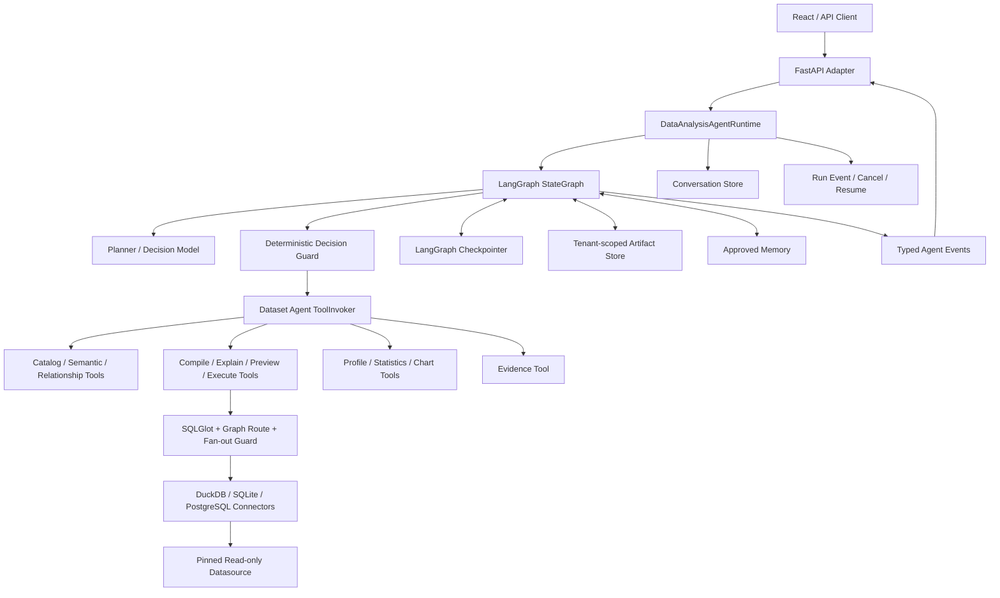
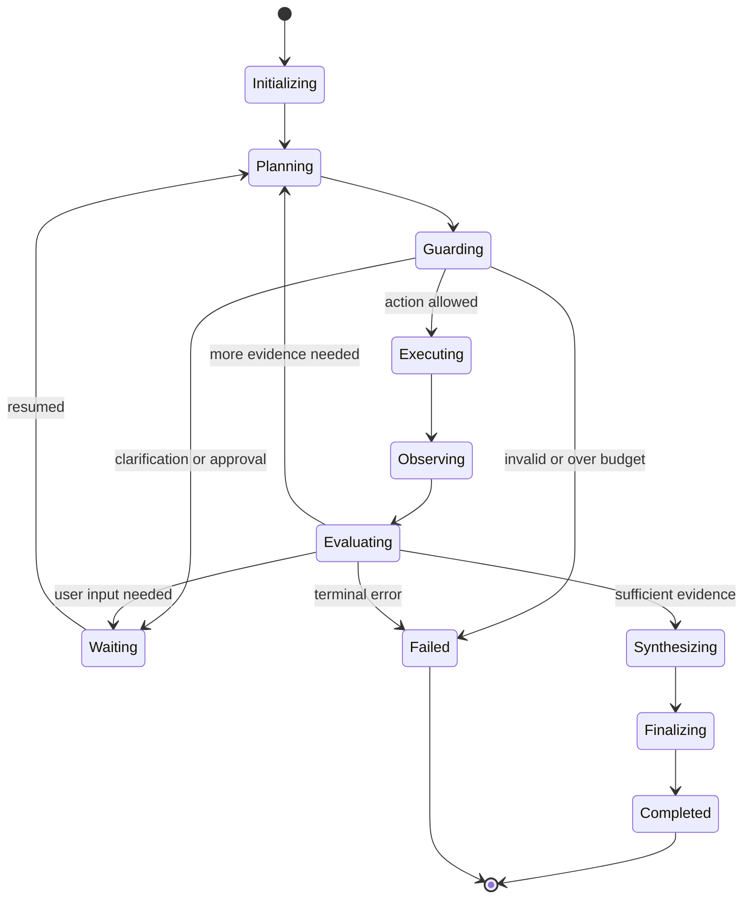

# Data Analysis Agent 架构设计

**状态：** 待实现，本文档冻结目标架构与迁移边界

**日期：** 2026-08-08

**对应实施计划：** `docs/superpowers/plans/2026-08-08-data-analysis-agent-implementation.md`

**目标读者：** 后续实现会话、后端/前端开发者、测试与安全评审人员

## 1. 文档目的

本文档定义如何把当前用户数据源主链路从“一次 LLM 规划 + 确定性编译执行”的 NL2SQL Workflow，升级为一个典型但受治理的 Data Analysis Agent。

本次升级的核心不是让模型直接编写并任意执行 SQL，也不是仅把现有执行器替换成 LangGraph。目标是让模型能够在严格授权和预算内：

1. 理解一个可能需要多步完成的分析目标；
2. 检查数据目录、字段语义、关系图和已有证据；
3. 动态拆解分析步骤并选择下一项工具；
4. 执行多次只读查询或确定性统计计算；
5. 根据工具结果判断证据是否充分；
6. 在结果为空、假设不成立或信息不足时重新规划；
7. 必要时暂停并请求用户澄清或审批；
8. 最终给出与 SQL、数据版本和结果证据绑定的结论。

最终产品必须保持“模型负责决策，系统负责授权与执行”的边界。

## 2. 当前基线

### 2.1 当前默认查询链路

当前用户数据源请求的主链路为：

```text
React Frontend
    → FastAPI / JWT / REST 或 SSE
    → DataSourceQueryService.run()
    → 固定四项 datasource/binding pins
    → DatasetLogicalPlanner 生成一个结构化 DatasetQueryPlan
    → DatasetQueryCompiler 使用 SQLGlot 确定性生成 SQL
    → Relationship Graph Route + Fan-out Guard
    → DuckDB / SQLite / PostgreSQL 只读 Connector
    → 单个结果集、表格/柱状图、回答和安全 trace
```

该链路的特点是：

- LLM 只生成一个逻辑查询计划；
- 后续步骤由代码固定；
- 一次请求通常只执行一个查询；
- 没有通用的“观察结果 → 选择下一步 → 再执行”循环；
- 澄清通过一个成功的 clarification 响应结束当前请求，而不是暂停并恢复同一个运行；
- 默认 API 不实例化 `LangGraphAdapter`；
- `build_runtime()` 的兼容 Pack 链路也默认使用 `InternalGraphExecutor`。

因此当前主链路是一个带 LLM Planner 的受治理 Workflow，而不是典型 Agent。

### 2.2 可直接复用的能力

以下能力已经存在，升级时必须复用而不是绕开：

- `AgentRequest`、`AgentResponse`、`DataAgentRuntime.run()` 和类型化 SSE 事件；
- 数据源不可变快照、目录版本和四项绑定 pins；
- v1/v2 Semantic Binding 与任意关系图；
- `GraphRouteResolver` 与 `FanoutGuard`；
- SQLGlot 确定性 SQL 编译；
- DuckDB、SQLite、PostgreSQL 只读 Connector；
- `ToolRegistry`、`ToolInvoker`、`AccessGrant`、`CredentialLease` 和 Tool Budget；
- 会话、运行事件、取消与回放；
- Memory 的 `propose → approval → commit` 边界；
- 前端的数据源、关系图、会话、证据抽屉和流式交互基础；
- pytest、Vitest、OpenAPI 和前端生成契约门禁。

### 2.3 必须替换的核心限制

- `DataSourceQueryService` 同时承担上下文解析、LLM 规划、编译、执行和回答，职责过于集中；
- `ModelClient` 只被用作单次计划生成器，没有 Agent Decision/Evaluation/Synthesis 契约；
- 用户数据源执行绕过现有通用 Tool Registry/Invoker；
- 当前 Execution Graph IR 的边主要基于固定 mode 和错误码，不支持模型驱动的动态行动循环；
- LangGraph 适配器把固定 `GraphSpec` 映射为 `StateGraph`，仅替换执行后端不会使其成为 Agent；
- 当前事件模型只有 started/progress/completed/failed，无法表示等待用户输入；
- 当前 checkpoint 与 conversation/run event store 没有成为默认用户数据源链路的可恢复 Agent 状态。

## 3. 目标与非目标

### 3.1 目标

- 默认 `/api/nl2sql` 和会话消息请求统一进入 `DataAnalysisAgentRuntime`；
- 支持多步计划、多次工具调用、观察、评估和有界重规划；
- Agent 可以动态选择目录检查、数据剖析、查询、统计、图表与证据工具；
- 每个 Agent 行动都必须先通过确定性 Decision Guard；
- 使用原生 LangGraph `StateGraph` 承载状态、条件路由、checkpoint、stream 和 interrupt；
- `conversation_id` 继续表达产品会话，`run_id` 作为单次 Agent 图的 LangGraph `thread_id`；
- 支持运行暂停、恢复、取消和事件回放；
- 保持 Plan、Preview、Execute 三种模式及其权限差异；
- 最终回答必须可追溯到版本 pins、工具调用、SQL、结果和证据；
- 默认仍然只执行只读数据分析，不增加写库或外部副作用；
- 保持多模型 provider 中立，不把实现绑定到某一家原生 tool-calling API。

### 3.2 非目标

- 不允许模型直接打开任意数据库连接或接触凭据；
- 不允许模型绕过 SQLGlot 编译器提交任意 SQL；
- 不在首期实现写库、发邮件、改文件、发布报表等副作用；
- 不在首期实现跨数据源联邦 JOIN；
- 不在首期执行模型生成的任意 Python、Shell、JavaScript 或 Notebook 代码；
- 不在 Agent state 或 checkpoint 中持久化数据库凭据、连接字符串或未脱敏秘密；
- 不展示或持久化模型私有 chain-of-thought；
- 不要求每条分析都产生完全相同的工具轨迹，只要求满足安全和结果不变量；
- 不把 LangGraph Studio 作为生产 API 服务器。

## 4. 已冻结的架构决策

1. 使用原生 LangGraph `StateGraph` 实现新的默认 Agent，不在现有固定 `GraphSpec` 上继续堆叠动态语义。
2. 现有 `LangGraphAdapter` 和 `COMMERCE_EXECUTION_GRAPH` 保留给 Pack/OList 兼容和回归测试，不进入新的默认用户数据源链路。
3. `DataSourceQueryService` 被拆分为可复用的 Planner 辅助、Compiler、Executor 和 Tool Provider；最终不再作为主流程控制器。
4. Agent 使用结构化 JSON 决策协议，而不要求所有模型 provider 支持原生 function calling。
5. 模型只选择“逻辑行动与结构化参数”；SQL 仍由确定性编译器生成。
6. 所有 Agent 工具必须通过统一 Registry/Invoker、权限检查、预算、超时、审计和脱敏。
7. LangGraph state 只存 JSON 可序列化的小型状态和 ArtifactRef；大型结果集存入独立、租户隔离的 Artifact Store。
8. 每个 run 使用独立 LangGraph `thread_id=run_id`；跨 turn 上下文从会话存储和已批准 Memory 重建，避免上一次 run 的临时状态泄漏到下一次 run。
9. 本地默认使用 `AsyncSqliteSaver`；生产可通过配置使用 `AsyncPostgresSaver`。两者必须实现相同测试契约。
10. 暂停状态是一等运行状态，不能伪装成 completed 或 failed。
11. 用户数据值是非可信内容；必须以结构化 observation 传递，并经过敏感字段、体积和提示注入防护。
12. 迁移采用“逐层抽取、测试内双跑、最终单路切换”。最终产品不保留长期可选的 workflow/agent 双主链路。
13. 新 Agent、评测和 Studio 全部完成迁移后，删除没有产品或回归职责的旧固定图、Pack/OList 兼容代码、配置、生成物和测试；不把“兼容”作为无限期保留死代码的理由。
14. 删除必须由可复现的引用审计、打包检查和测试证明支持，不能仅凭目录名称或静态 import 搜索判断。

## 5. 目标总体架构



依赖方向：

```text
API / CLI / Studio Adapter
        ↓
DataAnalysisAgentRuntime
        ↓
Compiled StateGraph
        ├──→ ModelClient Port
        ├──→ Dataset Agent ToolInvoker Port
        ├──→ Checkpointer Port
        ├──→ ArtifactStore Port
        ├──→ Conversation/Memory Ports
        └──→ Event Sink Port

ToolInvoker
        → Registry
        → Decision/Authority Policy
        → Deterministic Provider
        → Connector
```

禁止 Node 直接创建数据库连接、读取环境变量、访问 FastAPI Request 或写会话数据库。

## 6. Agent 运行模型

### 6.1 Agent 生命周期



### 6.2 节点职责

| 节点 | 类型 | 职责 |
| --- | --- | --- |
| `initialize_run` | 确定性 | 校验请求、身份、模式和四项 pins；创建 run authority 与预算 |
| `load_context` | 确定性/I/O | 加载目录、绑定、关系图、会话历史摘要和已批准 Memory |
| `plan_or_replan` | LLM | 生成或修订多步 AnalysisPlan，并选择下一项逻辑行动 |
| `guard_decision` | 确定性 | 校验行动 schema、工具允许集、mode、预算、pins、数据权限和前置 artifact |
| `request_input` | interrupt | 暂停，输出澄清或审批请求 |
| `execute_tool` | I/O | 通过 ToolInvoker 执行唯一被批准的工具调用 |
| `observe_result` | 确定性 | 规范化 ToolResult，写 ArtifactRef、EvidenceRef 和安全 Observation |
| `evaluate_progress` | 混合 | 先做确定性校验，再由 LLM 判断证据充分性、冲突和下一步 |
| `synthesize_answer` | LLM | 仅基于允许的 Observation/Evidence 生成结构化答案草稿 |
| `validate_answer` | 确定性 | 校验证据引用、图表字段、数值来源、敏感信息和响应契约 |
| `persist_turn` | I/O | 原子写入用户消息、助手消息、trace、artifact refs 和 memory proposals |
| `finalize_run` | 确定性 | 生成唯一 terminal event 并关闭资源 |

### 6.3 路由条件

`guard_decision` 只允许以下输出：

```text
execute_tool | request_input | synthesize_answer | fail
```

`evaluate_progress` 只允许以下输出：

```text
replan | request_input | synthesize_answer | fail
```

模型不能返回任意节点名，也不能直接影响 checkpoint、principal、pins、budget 或 connector。

### 6.4 有界循环

新增 `AgentRunBudget`：

```python
class AgentRunBudget(ContractModel):
    max_agent_steps: int = 16
    max_model_calls: int = 10
    max_tool_calls: int = 24
    max_query_compiles: int = 8
    max_query_previews: int = 6
    max_query_executes: int = 4
    max_replans: int = 4
    max_result_rows: int = 1000
    max_observation_cells_for_model: int = 400
    max_duration_seconds: int = 180
```

预算由服务端部署配置产生，客户端不能扩大。请求可选择更小预算，但不能超过部署上限。

每次进入模型节点、工具节点和重规划节点前都必须原子消耗对应预算。任何耗尽都返回 `AGENT_BUDGET_EXCEEDED`，不得静默继续。

## 7. Agent State 设计

### 7.1 状态原则

- State 保存原始、结构化事实，不保存拼接后的 Prompt；
- State 中所有值必须可安全序列化；
- 不保存 connector、pool、model client、文件句柄或 credential；
- 大型结果只保存 `AgentArtifactRef`；
- append-only 字段使用明确 reducer，其他字段使用 last-write；
- 每个状态更新必须能归因到一个 node 和 sequence；
- resume 后节点可能重启，产生副作用的操作必须幂等。

### 7.2 建议模型

```python
class AgentStatus(StrEnum):
    INITIALIZING = "initializing"
    RUNNING = "running"
    WAITING_INPUT = "waiting_input"
    COMPLETED = "completed"
    FAILED = "failed"
    CANCELLED = "cancelled"

class DatasetAuthority(PublicContractModel):
    tenant_id: str
    user_id: str
    source_id: str
    source_version: int
    binding_id: str
    binding_version: int
    schema_fingerprint: str
    allowed_relation_ids: tuple[str, ...]
    mode: AgentMode

class AnalysisGoal(PublicContractModel):
    original_question: str
    contextualized_question: str
    requested_output: str
    success_criteria: tuple[str, ...]
    constraints: tuple[str, ...] = ()

class AnalysisStep(PublicContractModel):
    step_id: str
    objective: str
    status: Literal["pending", "running", "completed", "blocked", "skipped"]
    depends_on: tuple[str, ...] = ()
    expected_evidence: tuple[str, ...] = ()

class AnalysisPlan(PublicContractModel):
    plan_id: str
    revision: int
    steps: tuple[AnalysisStep, ...]
    completion_criteria: tuple[str, ...]

class AgentAction(PublicContractModel):
    action_id: str
    tool_name: str
    arguments: dict[str, JsonValue]
    purpose: str
    expected_evidence: tuple[str, ...]

class AgentObservation(PublicContractModel):
    observation_id: str
    action_id: str
    tool_name: str
    status: Literal["succeeded", "failed"]
    summary: str
    artifact_refs: tuple[AgentArtifactRef, ...] = ()
    evidence_refs: tuple[EvidenceRef, ...] = ()
    safe_preview: tuple[dict[str, JsonValue], ...] = ()
    error: AgentError | None = None

class AnalysisAgentState(TypedDict, total=False):
    run_id: str
    conversation_id: str | None
    request: AgentRequest
    authority: DatasetAuthority
    goal: AnalysisGoal
    context: AgentContextSnapshot
    plan: AnalysisPlan
    pending_action: AgentAction | None
    observations: Annotated[list[AgentObservation], append_observations]
    artifact_refs: Annotated[list[AgentArtifactRef], append_unique_artifacts]
    evidence_refs: Annotated[list[EvidenceRef], append_unique_evidence]
    budget: AgentBudgetState
    plan_revision_count: int
    status: AgentStatus
    waiting_request: AgentInputRequest | None
    answer_draft: AgentAnswerDraft | None
    final_response: AgentResponse | None
    error: AgentError | None
```

### 7.3 Runtime context 与 State 分离

以下对象通过 LangGraph runtime/context 或闭包注入，不进入 checkpoint：

- `ModelClient`；
- `DatasetAgentToolInvoker`；
- `DataSourceService`；
- `ArtifactStore`；
- `MemoryManager`；
- `EventWriter`；
- `Clock`、`IdFactory`；
- credential broker 与数据库 pool。

## 8. 结构化模型决策协议

### 8.1 Provider 中立

现有 `ModelClient.complete(prompt, system, max_output_tokens)` 保持公共最小协议。Planner、Evaluator 和 Synthesizer 都要求模型返回严格 JSON，并通过 Pydantic 校验。

不把原生 tool calling 作为首期依赖，原因是当前支持 OpenAI-compatible、Gemini 和 Anthropic 多种 transport。以后可在 adapter 内优化，但不能改变 Agent 的结构化契约。

### 8.2 Planner 输出

```python
class PlannerDecision(PublicContractModel):
    plan: AnalysisPlan
    decision: Literal["act", "clarify", "finish", "fail"]
    next_action: AgentAction | None = None
    clarification: AgentInputRequest | None = None
    completion_summary: str | None = None
    rationale_summary: str
```

`rationale_summary` 只能是简短、面向审计的决策摘要，不能要求或保存私有思维链。

### 8.3 Evaluator 输出

```python
class EvaluationDecision(PublicContractModel):
    decision: Literal["continue", "replan", "clarify", "finish", "fail"]
    evidence_sufficient: bool
    completed_step_ids: tuple[str, ...]
    missing_evidence: tuple[str, ...]
    contradictions: tuple[str, ...]
    clarification: AgentInputRequest | None = None
    rationale_summary: str
```

确定性检查优先于模型判断：工具失败、artifact digest 不匹配、pins 变化、结果字段缺失、数值非有限或预算耗尽时，模型不能覆盖系统结论。

### 8.4 Synthesizer 输出

```python
class AgentAnswerDraft(PublicContractModel):
    answer: str
    key_findings: tuple[FindingDraft, ...]
    recommended_chart_artifact_id: str | None
    limitations: tuple[str, ...]
    evidence_ids: tuple[str, ...]
```

每个含数字的 `FindingDraft` 必须引用至少一个 EvidenceRef；答案不得引用不存在或不属于当前 run 的证据。

## 9. 工具系统

### 9.1 工具目录

默认 Dataset Agent Registry 包含：

| 工具 | 作用 | 是否访问数据 | 模式 |
| --- | --- | --- | --- |
| `catalog.inspect` | 获取 pinned catalog、字段、键和估算行数 | 控制面 | 全部 |
| `semantic.inspect` | 获取 active binding、逻辑字段和关系角色 | 控制面 | 全部 |
| `relationship.route` | 对所需逻辑字段解析确定性 JOIN 路由 | 否 | 全部 |
| `data.profile` | 生成字段分布、空值、唯一值和时间范围摘要 | 只读 | Preview/Execute |
| `query.compile` | 将逻辑查询计划编译为 PreparedQuery | 否 | 全部 |
| `query.explain` | 获取查询成本和计划摘要 | 只读 | Preview/Execute |
| `query.preview` | 执行有限行数预览 | 只读 | Preview/Execute |
| `query.execute` | 执行只读完整查询，仍受最大行数限制 | 只读 | Execute |
| `result.profile` | 校验结果粒度、类型、空值和基础统计 | artifact | Preview/Execute |
| `analysis.compute` | 对 artifact 执行受限统计 DSL | artifact | Preview/Execute |
| `chart.render` | 从 artifact 生成安全 ChartSpec | artifact | Preview/Execute |
| `evidence.collect` | 固化 SQL、pins、artifact digest 和结论证据 | 否 | 全部 |

### 9.2 不提供任意代码工具

`analysis.compute` 接受受限 DSL，而不是 Python 字符串：

```python
class ComputationSpec(PublicContractModel):
    operation: Literal[
        "describe",
        "quantiles",
        "correlation",
        "growth_rate",
        "moving_average",
        "rank",
        "outlier_iqr",
    ]
    artifact_id: str
    fields: tuple[str, ...]
    partition_by: tuple[str, ...] = ()
    order_by: tuple[str, ...] = ()
    parameters: dict[str, JsonValue] = Field(default_factory=dict)
```

实现使用受限 DuckDB/纯 Python 运算，输入只能是当前 run 的 artifact。不得访问文件系统任意路径、网络、环境变量或数据库凭据。

### 9.3 Authority Envelope

将现有只面向 Pack bundle 的 ToolInvocationContext 泛化为权威来源 union：

```python
AuthorityEnvelope = Annotated[
    PackAuthority | DatasetAuthority,
    Field(discriminator="kind"),
]
```

ToolSpec 必须声明支持的 authority kind、允许 mode、是否需要 connector、是否可能产生敏感 artifact。Invoker 从服务端 state 注入 authority，模型参数不得包含或覆盖 authority 字段。

### 9.4 Decision Guard

每次工具调用前按顺序执行：

1. 工具存在且属于当前 registry snapshot；
2. 工具允许当前 authority kind 与 AgentMode；
3. 输入通过严格 Pydantic schema；
4. 引用的 artifact 属于当前 tenant/user/run；
5. 引用的 source/binding 与 state pins 完全一致；
6. 依赖 artifact 已存在且 digest 校验通过；
7. 当前预算足够；
8. 工具要求的关系、行数、超时和 capability 可被 grant 表达；
9. 若触发审批策略，则转入 interrupt，不执行工具；
10. 生成 AccessGrant/CredentialLease 后调用 Provider。

任何失败都产生类型化 Observation，模型不能以新参数自动扩大权限。

## 10. Artifact 与 Evidence

### 10.1 为什么需要独立 Artifact Store

典型数据分析 Agent 可能在一个 run 中产生多个目录快照、逻辑计划、SQL、预览、查询结果、统计表和图表。把完整结果放进 LangGraph checkpoint 会导致体积膨胀、敏感数据扩散和恢复性能下降。

### 10.2 Artifact 模型

```python
class AgentArtifactKind(StrEnum):
    CATALOG = "catalog"
    LOGICAL_PLAN = "logical_plan"
    PREPARED_QUERY = "prepared_query"
    QUERY_PREVIEW = "query_preview"
    QUERY_RESULT = "query_result"
    PROFILE = "profile"
    COMPUTATION = "computation"
    CHART = "chart"
    ANSWER = "answer"

class AgentArtifactRef(PublicContractModel):
    artifact_id: str
    run_id: str
    kind: AgentArtifactKind
    digest: str
    schema_digest: str | None
    row_count: int | None
    sensitivity: Literal["metadata", "derived", "row_data"]
    created_at: datetime
```

### 10.3 存储实现

默认实现：

```text
DATA_AGENT_STATE_DIR/
├── control/agent-artifacts.sqlite3
└── artifacts/<tenant-hash>/<user-hash>/<run-id>/<artifact-id>.json
```

- 路径由服务端 ID factory 生成，不接受用户路径；
- 文件写入采用临时文件 + 原子 rename；
- metadata 与 payload 都包含 digest；
- 读取必须同时匹配 tenant、user、run 和 artifact_id；
- 文件权限遵循现有 state root 私有权限；
- 默认不使用 pickle；
- 支持按 retention policy 清理已完成 run；
- final response 中保留安全摘要和必要 bounded rows，不能依赖已清理 artifact 才能显示基本历史。

### 10.4 Evidence 模型

```python
class EvidenceRef(PublicContractModel):
    evidence_id: str
    claim_key: str
    artifact_id: str
    source_id: str
    source_version: int
    binding_id: str
    binding_version: int
    schema_fingerprint: str
    sql_digest: str | None
    result_digest: str
    field_refs: tuple[str, ...]
```

Evidence 只能引用已验证 artifact；不能只引用模型生成文本。

## 11. Checkpoint、暂停与恢复

### 11.1 Checkpointer

- 本地默认依赖 `langgraph-checkpoint-sqlite` 的 `AsyncSqliteSaver`；
- 生产可配置 `langgraph-checkpoint-postgres` 的 `AsyncPostgresSaver`；
- 测试可使用 `InMemorySaver`；
- graph 必须在 `compile(checkpointer=...)` 时注入；
- checkpoint serializer 禁止 pickle fallback；
- 若持久化内容包含敏感 row preview，生产必须启用加密 serializer 或确保 state 只保留脱敏 preview 和 ArtifactRef。

LangGraph 官方持久化模型以 thread 组织每一步 checkpoint，并用于恢复、HITL 和故障续跑：<https://docs.langchain.com/oss/python/langgraph/persistence>。

### 11.2 Run 与 thread 映射

```text
LangGraph configurable.thread_id = run_id
product conversation_id           = 跨 turn 会话
tenant/user                       = Runtime context + 每次读取校验
```

每个新用户消息创建新 run。Follow-up 上下文由 Conversation Store 和 approved Memory 加载，不直接复用上一个已完成图的临时 state。

### 11.3 暂停原因

```python
class AgentInputReason(StrEnum):
    CLARIFICATION = "clarification"
    APPROVAL = "approval"
    CONFLICT_RESOLUTION = "conflict_resolution"
```

首期至少实现：

- 问题缺少必要维度、指标或时间范围时澄清；
- 多条关系路由同等可信时让用户选择；
- 查询成本超过自动执行阈值但未超过硬上限时审批；
- 模型给出的结论与确定性结果校验冲突时请求用户选择是否继续探索。

### 11.4 Resume 契约

新增：

```http
POST /api/runs/{run_id}/resume
POST /api/runs/{run_id}/resume/stream
```

请求：

```json
{
  "interrupt_id": "interrupt-...",
  "decision": "respond",
  "message": "按下单时间统计最近 12 个月",
  "edited_action": null
}
```

服务端必须校验：

- run 属于当前 tenant/user；
- run 状态为 waiting；
- interrupt_id 与最新 checkpoint 完全一致；
- 一个 interrupt 只能成功消费一次；
- resume 不允许修改 source/binding pins；
- 恢复后使用 `Command(resume=...)` 继续原图。

LangGraph interrupt 会在暂停时保存状态并在恢复时重新进入节点，因此 interrupt 前的副作用必须幂等：<https://docs.langchain.com/oss/python/langgraph/interrupts>。

## 12. API 与事件协议

### 12.1 AgentEventType v2

保留现有事件并增加：

```text
run_started
context_resolved
plan_updated
step_started
tool_started
tool_completed
observation_recorded
run_waiting
run_resumed
answer_synthesizing
run_completed
run_failed
```

每个事件必须是严格 discriminated union，不能继续使用无类型 `Record<string, JsonValue>` 作为长期契约。

事件只公开：

- 步骤目标与状态；
- 工具显示名和安全参数摘要；
- bounded observation 摘要；
- artifact/evidence metadata；
- 等待用户的明确问题；
- 错误码和可恢复性。

事件不得公开：

- system prompt；
- chain-of-thought；
- credential、DSN 或环境变量；
- 未脱敏 Tool payload；
- 内部文件路径；
- 超出行/单元格限制的结果。

### 12.2 AgentResponse 扩展

保持现有 `sql`、`rows`、`chart` 等便利字段，并增加：

```python
class AgentResponse(PublicContractModel):
    # existing fields...
    analysis_plan: AnalysisPlan | None = None
    analysis_steps: tuple[AnalysisStepSummary, ...] = ()
    artifacts: tuple[AgentArtifactSummary, ...] = ()
    evidence: tuple[EvidenceSummary, ...] = ()
    limitations: tuple[str, ...] = ()
```

`sql` 和 `rows` 表示最终回答主要依赖的结果；完整多步历史通过 artifacts/evidence/trace 表达。

### 12.3 Version Pins v2

将当前只适合 Pack 的 `RuntimeVersionPins` 改为 discriminator union：

```python
RuntimeVersionPins = Annotated[
    PackRuntimeVersionPins | DatasetRuntimeVersionPins,
    Field(discriminator="kind"),
]

class DatasetRuntimeVersionPins(PublicContractModel):
    kind: Literal["dataset"] = "dataset"
    runtime_version: str
    graph_id: str
    graph_version: str
    graph_digest: str
    tool_registry_version: str
    model_versions: tuple[ComponentVersionPin, ...]
    source_id: str
    source_version: int
    binding_id: str
    binding_version: int
    schema_fingerprint: str
    relationship_graph_digest: str | None
```

旧 Pack 响应使用 `kind="pack"`。生成的 OpenAPI、Apifox 和前端 schema 必须同步更新。

## 13. Plan、Preview、Execute 语义

### 13.1 Plan

- 允许 catalog/semantic/relationship/query.compile/evidence 工具；
- 禁止任何需要数据连接 credential 的工具；
- 可以生成多步骤分析计划和一个或多个候选 PreparedQuery；
- 最终回答明确“未执行数据查询”。

### 13.2 Preview

- 允许数据剖析、explain、preview、有限统计和图表；
- 禁止 `query.execute`；
- 每次 preview 的行数和总 preview 次数均受预算限制；
- 最终结论必须标注基于预览，不能表述为全量精确结论。

### 13.3 Execute

- 允许全部只读工具；
- 仍必须先 compile，并根据策略决定是否 explain/preview；
- 允许多个查询，但每个查询都固定相同 authority pins；
- 最终 answer 可以综合多个结果集，但每个 finding 必须有 evidence。

## 14. Conversation 与 Memory

### 14.1 Conversation

Conversation Store 继续作为用户可见历史的权威来源。每次 turn 原子保存：

- 用户原始问题；
- contextualized goal；
- 最终 AnalysisPlan 摘要；
- 完成步骤；
- 最终答案、主要 rows/chart；
- evidence summaries；
- safe trace 和 version pins；
- pending memory proposals。

暂停中的 run 不写最终助手消息，只写 run event/checkpoint。恢复并完成后再写一次完整 turn。

### 14.2 Short-term Agent State

短期 state 由 Checkpointer 管理，仅服务当前 run 的恢复，不等同于长期 Memory。

### 14.3 Long-term Memory

保留现有作用域与审批边界：

- 用户偏好可以生成 user memory proposal；
- 已验证且有复用价值的分析方法可以生成 episodic proposal；
- 企业共享定义仍需 memory admin 审批；
- 模型不能直接 commit；
- 数据源 pins、绑定和访问策略永远不是 Memory。

## 15. 安全设计

### 15.1 保持不变的硬边界

- 四项 source/binding pins 必须成组提供并在整个 run 中不可变；
- 数据源重新发布或 binding 失效后，旧 run 恢复必须以 `BINDING_STALE` 失败；
- SQL 只能来自编译器生成的 PreparedQuery；
- Connector 只接受匹配的 AccessGrant、CredentialLease 和 digest；
- 所有查询只读，带 statement timeout、relation allowlist 和 max rows；
- Agent 不得扩大 principal role 或跨 tenant/user 读取 state/artifact/event。

### 15.2 Prompt Injection 防护

- 上传的数据值、列名、表注释和数据库注释全部视为非可信数据；
- Prompt 中将工具输出放入明确的 JSON data block，而不是拼接为 instruction；
- 系统 Prompt 明确禁止遵循数据内容中的指令；
- observation sanitizer 限制单元格数量、字符串长度和嵌套深度；
- 已识别敏感字段默认只给模型聚合摘要，不给原始值；
- 工具返回中的 SQL、路径、错误文本必须脱敏后再送入模型。

### 15.3 恢复与幂等

- 所有 ToolCall 使用稳定 `call_id`；
- Artifact Store 对相同 run/call/digest 幂等；
- Query 工具在恢复时若发现相同 call 已完成，返回原 ArtifactRef，不重复执行；
- Memory proposal 和 conversation turn 使用幂等键；
- cancel 后禁止 resume，除非未来增加显式 clone/fork 功能。

### 15.4 新错误码

```text
AGENT_DECISION_INVALID
AGENT_ACTION_NOT_ALLOWED
AGENT_BUDGET_EXCEEDED
AGENT_MAX_STEPS_EXCEEDED
AGENT_EVIDENCE_INSUFFICIENT
AGENT_RESPONSE_UNGROUNDED
AGENT_WAITING_FOR_INPUT
AGENT_INTERRUPT_STALE
AGENT_RESUME_CONFLICT
AGENT_ARTIFACT_NOT_FOUND
AGENT_ARTIFACT_INTEGRITY_ERROR
AGENT_CHECKPOINT_UNAVAILABLE
```

公共错误继续使用安全中文 message；内部原因只进入脱敏审计。

## 16. 前端体验

### 16.1 主工作台

在现有 Evidence Rail 基础上增加可折叠的“分析步骤”区域：

```text
数据范围 → 分析计划 → 正在执行 → 证据验证 → 回答
```

每个步骤显示：

- 目标；
- `待执行 / 执行中 / 已完成 / 等待输入 / 失败`；
- 工具的业务化名称；
- 安全结果摘要；
- 相关 artifact/evidence 入口。

### 16.2 等待输入

收到 `run_waiting` 后：

- 停止普通 composer 对该 run 的重复提交；
- 显示 clarification/approval 卡片；
- 用户输入通过 resume API 提交；
- 页面刷新后通过 run event replay 恢复等待状态；
- 其他会话仍可正常使用。

### 16.3 不展示思维链

前端只展示 Planner 的步骤目标、行动目的和 evaluator 的结论摘要，不展示隐藏推理、完整 Prompt 或模型 token 流。

## 17. 可观测性

每个 run 至少记录：

- run/conversation/tenant/user 的安全关联 ID；
- graph/model/tool/version pins；
- node 开始/结束时间；
- model call 次数、延迟和 token 使用量（若 provider 返回）；
- tool call、预算消耗、重试和错误分类；
- query compile/preview/execute 次数；
- artifact/evidence digest；
- replan 次数和暂停时长；
- terminal status。

允许接入 LangSmith 等 tracing backend，但本地结构化 trace 和 run event store 必须足以完成基础审计，不能把产品正确性依赖外部 SaaS。

## 18. 测试与评测策略

### 18.1 单元测试

- State reducer、模型严格校验和序列化；
- Planner/Evaluator JSON 解析与拒绝非法输出；
- Decision Guard 的 mode、authority、artifact 和 budget 校验；
- Agent 路由的所有分支；
- Artifact Store 的租户隔离、digest 和幂等；
- Observation sanitizer；
- Tool Provider 输入输出契约；
- answer grounding validator；
- interrupt/resume/cancel 状态机。

### 18.2 集成测试

- 两次查询才能回答的问题；
- preview 为空后更换筛选条件并重规划；
- 关系路径歧义后暂停、用户选择并恢复；
- stale binding 恢复失败；
- 预算耗尽安全终止；
- 服务重启后从 SQLite checkpoint 恢复；
- 取消中的工具调用并禁止后续 resume；
- 跨 tenant/user 读取 checkpoint/artifact/run event 被拒绝；
- Plan 模式不会进入 credential tool；
- Preview 模式不会执行 full query；
- Execute 模式最终 evidence 与返回数值一致。

### 18.3 轨迹评测

Agent 评测不比较唯一节点序列，而检查不变量：

- 是否选择了允许的工具；
- 是否在查询前固定 authority；
- 是否在预算内完成；
- 是否产生足够 evidence；
- 数值结论是否由 result artifact 支持；
- 是否存在冗余或重复查询；
- 遇到信息不足时是否澄清而非猜测；
- 遇到结果冲突时是否继续验证或声明限制。

### 18.4 安全测试

- 数据单元格包含“忽略系统指令”文本；
- 恶意表名/列名/错误文本；
- 模型请求任意 SQL、写操作、其他 source 或其他 artifact；
- 模型试图修改 pins、budget、principal；
- artifact path traversal 和 digest 替换；
- resume token 重放；
- event replay 越权；
- 超长 observation 和 checkpoint 放大攻击。

## 19. 性能与容量

首期目标不是提高单查询吞吐，而是在可控开销内支持多步分析：

- 每个 run 默认最多 16 个 Agent step；
- 模型和查询节点均使用独立 timeout；
- 同一 conversation 默认只允许一个 active run；
- 不同 conversation 可并发；
- Artifact payload 不进入 SSE，只传 summary/ref；
- 对模型发送的 observation 有单元格、字符和 token 预算；
- 查询结果仍受 1000 行默认上限；
- 运行完成后异步清理临时 artifact，但不会删除会话所需的安全摘要。

## 20. 迁移策略

### 20.1 阶段原则

1. 先抽取确定性能力，不改变行为；
2. 再建立 Tool Registry 与 Agent contracts；
3. 在测试中运行新 Agent，不切 API；
4. 接入 checkpoint/interrupt/SSE；
5. 前端支持后切换默认 API；
6. 完成回归后删除默认路径的 `DataSourceQueryService` 分支；
7. 将旧黄金能力迁移到新 Agent 后执行死代码和仓库资产清理，不长期维护两套实现与两套测试。

### 20.2 最终代码边界

建议新增：

```text
src/data_agent/analysis_agent/
├── __init__.py
├── models.py
├── state.py
├── prompts.py
├── planner.py
├── evaluator.py
├── synthesizer.py
├── guard.py
├── nodes.py
├── routing.py
├── graph.py
├── runtime.py
├── checkpoints.py
├── artifacts.py
└── composition.py

src/data_agent/tools/providers/dataset/
├── catalog.py
├── semantic.py
├── relationship.py
├── query.py
├── profile.py
├── compute.py
├── chart.py
├── evidence.py
└── registry.py
```

现有 `src/data_agent/execution/` 只在迁移期保留 Pack compatibility；不要让新用户数据源 Agent 继续依赖 `COMMERCE_EXECUTION_GRAPH`。

新 Agent 的结果级黄金评测、checkpoint、Studio 和发布门禁全部稳定后，应执行旧链路退役审计。若以下模块仅剩旧 Pack/OList 引用，则迁移必要的通用类型后删除：

```text
src/data_agent/execution/ 中仅服务固定 GraphSpec/InternalGraphExecutor 的模块
src/data_agent/runtime/ 中仅服务 Bundle/Pack compatibility 的模块
src/data_agent/skills/commerce/ 中仅服务 OList Pack 的模块
src/data_agent/tools/providers/ 中仅服务旧六工具 Pack Registry 的模块
packs/domains/commerce/
packs/enterprises/olist/
packs/deployments/olist-local.yaml
generated/bundles/olist-local.json
generated/semantic/commerce.json
schema_catalog.json（仅当无默认数据源或测试仍引用）
OList 专用导入、编译、重建索引和 golden fixture 脚本
仅验证已删除链路的测试与历史生成契约
```

不得删除仍被新 Agent 复用的通用模型、Connector、Memory、关系图、编译器或安全策略。任何候选删除项都必须在实施计划的 removal manifest 中记录“迁移到哪里、引用证据、验证命令和恢复方式”。

## 21. 发布与回滚

### 21.1 发布门禁

- 后端全量测试通过；
- 前端测试和生产构建通过；
- OpenAPI/Apifox/前端生成 schema 新鲜度通过；
- 至少一组 CSV、XLSX、SQLite、PostgreSQL 数据源 Agent 集成测试通过；
- checkpoint 重启恢复测试通过；
- 安全用例全部通过；
- Agent 与当前 workflow 对单查询黄金用例结果等价；
- 多步 Agent 专属用例达到验收阈值；
- 没有 credential、原始路径或 chain-of-thought 出现在 event/checkpoint/trace。

### 21.2 回滚边界

实施过程中允许 composition 注入旧 executor 供测试比较，但不增加长期用户配置开关。切换前保留旧代码一个迁移阶段；发布验证完成后移除默认 API 分支。

如果切换后需要紧急回滚，回滚应用版本即可。新建的 agent checkpoint/artifact 表与文件是附加数据，不修改 datasource snapshot 或 semantic binding，可由旧版本忽略。数据库迁移必须是向前兼容的 additive migration。

## 22. 验收标准

完成定义：

1. 默认前端/API 用户数据源请求实际进入原生 LangGraph Agent；
2. 一个测试问题可以自动执行至少两项不同工具并基于观察重新决定下一步；
3. 一个失败/空结果场景可以在预算内重规划后成功，或给出有证据的安全失败；
4. 一个澄清场景可以 pause、跨进程重启、resume 并完成；
5. 所有 SQL 仍由确定性编译器产生并通过只读 Connector；
6. Agent 无法修改 authority pins、越权调用工具或跨租户读取 artifact；
7. 最终每个关键数值 finding 均有 EvidenceRef；
8. Plan/Preview/Execute 权限语义保持正确；
9. SSE、取消、回放、会话历史和前端交互全部可用；
10. 旧单查询能力没有结果级回归；
11. LangGraph Studio 可以加载新 Agent 图进行开发调试，但生产仍通过 FastAPI Runtime；
12. README、reading guide、OpenAPI 和生成契约与新主链路一致。

## 23. 后续扩展边界

不属于本次实现、但目标架构允许后续增加：

- 受隔离的 Python/Notebook 计算沙箱；
- 多 Agent 专家协作；
- 并行独立分析步骤；
- 跨数据源联邦查询；
- 写操作和外部副作用的强审批工具；
- Agent trajectory 在线评测与自动回归采样；
- 更丰富的图表和报告生成。

这些扩展必须继续经过 Tool Registry、Authority、Budget、Artifact 和 Evidence 边界，不能通过给模型开放通用代码执行来绕过系统。
