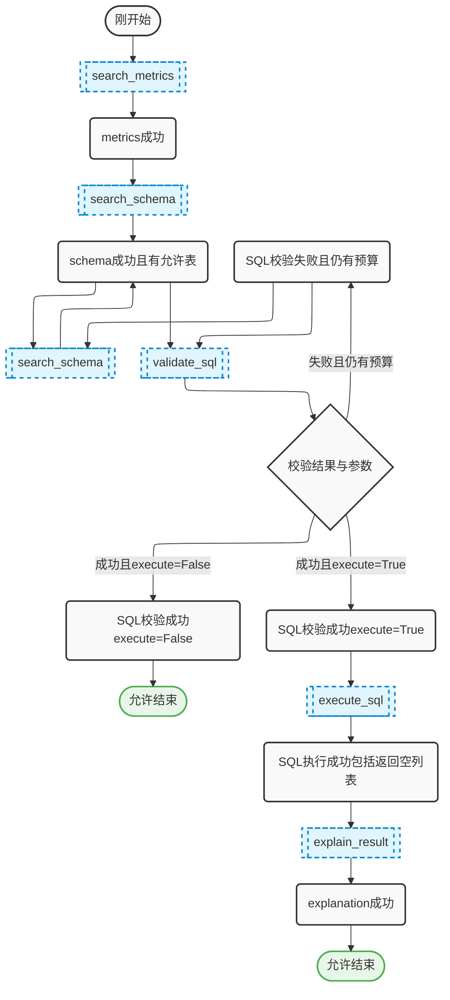

## 1、Tool Policy设计

| 当前状态                     | 可暴露工具                  |
| :--------------------------- | :-------------------------- |
| 刚开始                       | search_metrics              |
| metrics 成功                 | search_schema               |
| schema 成功且有允许表        | search_schema, validate_sql |
| SQL 校验失败且仍有预算       | search_schema, validate_sql |
| SQL 校验成功，execute=False  | 无工具，允许结束            |
| SQL 校验成功，execute=True   | execute_sql                 |
| SQL 执行成功，包括返回空列表 | explain_result              |
| explanation 成功             | 无工具，允许结束            |

