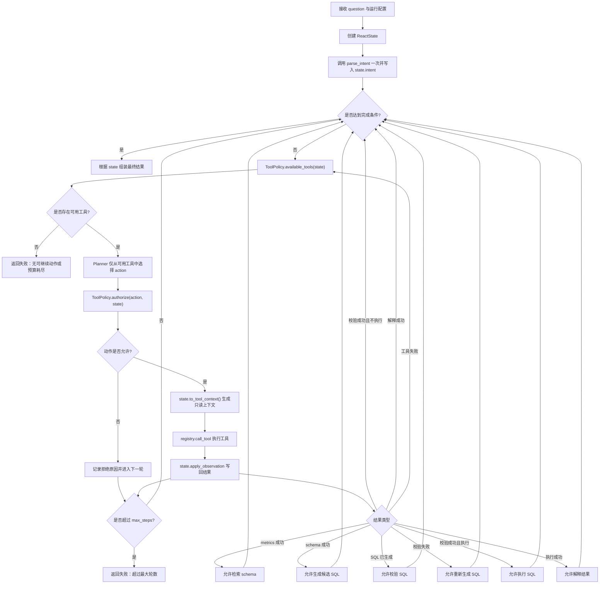

**关键设计选择**

你当前的 [registry.py](/D:/yehj/nl2sql/agent/tools/registry.py) 没有注册 `generate_sql`，而 [tool_policy.py](/D:/yehj/nl2sql/agent/tool_policy.py) 目前允许模型直接选择 `validate_sql` 并提交 SQL。

对于你的项目，推荐调整为：

```text
parse_intent 初始化执行一次
      ↓
ReAct loop 动态调用：
search_metrics -> search_schema -> generate_sql -> validate_sql
                                            ↑            |
                                            └-- 校验失败 --┘
      ↓
execute_sql -> explain_result
```

原因：

- 复用你已经完成的 [sql_generator.py](/D:/yehj/nl2sql/agent/sql_generator.py)，不在 planner 中重复 SQL 生成逻辑。
- SQL 校验失败后，应重新生成 SQL，而不是再次校验同一条 SQL。
- `validate_sql` 应校验 state 中受控保存的候选 SQL，不应接受 planner 临时提交的任意 SQL。
- `parse_intent` 是每次请求只需执行一次的准备工作，不需要做成动态工具。

替代方案是让 planner 直接输出 SQL 并调用 `validate_sql`。它减少一次模型调用，但会绕过现有 SQL generator 的 prompt、重试反馈与测试资产，不建议用于当前项目。

---

**流程图**



---

**各步骤设计原因**

| 步骤 | 设计 | 原因 |
|---|---|---|
| 初始化 state | 保存 question、tenant、execute 开关、预算等 | 全流程只有一个状态来源 |
| 初始化解析 intent | 在 loop 前执行一次 `parse_intent` | 它不是动态决策，不值得反复调用 |
| 先检查完成条件 | `can_finish()` 优先于再次规划 | 防止已有合法结果后模型继续调用工具并污染状态 |
| 查询可用工具 | `available_tools(state)` | 模型只看到当前阶段允许使用的能力 |
| 检查空工具集 | 无工具且未完成时直接失败 | 避免预算耗尽后死循环 |
| planner 选择 action | 只输出结构化工具调用 | 调度层容易解析、测试和拒绝非法动作 |
| 二次授权 | `authorize()` 在执行前兜底 | 即使 planner 输出错误动作也不会越权执行 |
| 生成 ToolContext | 从 state 派生只读调用上下文 | `tenant_id`、`dsn`、授权表不会由模型改写 |
| 执行工具 | 统一经过 registry | 参数校验与工具适配集中管理 |
| 写回 observation | 统一由 state 更新 | trace、预算、下游状态失效规则保持一致 |
| 总轮数限制 | loop 单独维护 turn 数 | 被 policy 拒绝的动作没有 observation，但也必须消耗轮次 |

---

**你需要先调整的工具链契约**

目前最大的缺口不是 loop 本身，而是 `generate_sql` 尚未成为受控动作。

建议的新工具顺序如下：

| 工具 | 输入来源 | 输出写入 state |
|---|---|---|
| `search_metrics` | planner 可提供检索 query | `metrics_result`、`table_names` |
| `search_schema` | planner query + state 的 `table_names` | `schema_result`、`allowed_tables` |
| `generate_sql` | state 中的 question、intent、metrics、schema、上次校验反馈 | 最新候选 SQL |
| `validate_sql` | state 中的最新候选 SQL、`allowed_tables` | `validation_result` |
| `execute_sql` | state 中的 `validated_sql` | `execution_result` |
| `explain_result` | state 中的执行结果 | `explanation_result` |

关键点：

- `generate_sql` 可以在 registry 适配层将原本返回的字符串包装为结构化 observation；无需改动 SQL generator 的核心职责。
- 接入 `generate_sql` 后，`validate_sql` 不应再让 planner 提供 `sql` 参数，而应校验 state 中最新生成的 SQL。
- SQL 校验失败时，policy 应重新开放 `generate_sql`，而不是仅开放再次校验。

---

**需要修改或新增的文件**

| 文件 | 操作 | 需要承担的职责 |
|---|---|---|
| [agent/react_loop.py](/D:/yehj/nl2sql/agent/react_loop.py) | 新增 | 创建 state、执行循环、完成判断、死路判断、调用 planner/policy/registry |
| `agent/react_planner.py` | 建议新增 | 构造 planner prompt、解析结构化 action、限制输出格式 |
| [agent/tools/registry.py](/D:/yehj/nl2sql/agent/tools/registry.py) | 修改 | 注册 `generate_sql`；让 `validate_sql` 使用 state 派生的候选 SQL |
| [agent/tools/descriptions.py](/D:/yehj/nl2sql/agent/tools/descriptions.py) | 修改 | 添加 `generate_sql` 工具描述 |
| [agent/react_state.py](/D:/yehj/nl2sql/agent/react_state.py) | 修改 | 支持 `generate_sql` observation；保存最新候选 SQL；生成校验失败反馈 |
| [agent/tool_policy.py](/D:/yehj/nl2sql/agent/tool_policy.py) | 修改 | 加入 `generate_sql` 可用规则；调整校验失败后的重试路径 |
| `tests/test_agent_react_loop.py` | 新增 | 覆盖完整循环、失败退出、轮数限制和越权动作 |
| [tests/test_agent_tool_registry.py](/D:/yehj/nl2sql/tests/test_agent_tool_registry.py) | 修改 | 测试 `generate_sql` adapter 与受控 SQL 校验 |
| [tests/test_agent_tool_policy.py](/D:/yehj/nl2sql/tests/test_agent_tool_policy.py) | 修改 | 将“校验失败再次 validate”改为“校验失败后重新 generate” |
| `tests/test_agent_react_state.py` | 建议新增 | 测试候选 SQL 写回、校验失效、重试反馈与 trace |

第一阶段暂时不要修改 [pipeline.py](/D:/yehj/nl2sql/agent/pipeline.py) 和 `main.py`。先让新的 loop 独立通过测试，再考虑增加 `--react-agent` 或模式切换入口。

---

**`ReactState` 需要补充的状态含义**

建议明确以下状态：

| 状态 | 含义 |
|---|---|
| `intent` | 初始化阶段得到的用户意图 |
| `raw_sql` 或 `candidate_sql` | 最近一次 `generate_sql` 得到、尚待校验的 SQL |
| `validation_result` | 针对当前候选 SQL 的校验结果 |
| `validated_sql` | 仅当当前候选 SQL 校验成功时可读取 |
| `retry_feedback` | 根据最近一次校验失败结果派生，供下一次生成 SQL 使用 |
| `execution_result` | 已验证 SQL 的执行结果 |
| `explanation_result` | 执行结果的解释 |

其中 `candidate_sql` 比 `raw_sql` 更清晰。如果你保留 `raw_sql` 名称，也应把它的语义改为“最近生成的候选 SQL”，而不是等到校验阶段才保存。

---

**`ToolPolicy` 应调整的阶段规则**

| 当前状态 | 可开放工具 |
|---|---|
| 已有 intent，尚无 metrics | `search_metrics` |
| metrics 成功，尚无 schema | `search_schema` |
| schema 成功且有授权表，尚无候选 SQL | `generate_sql`，可选开放剩余预算内的 `search_schema` |
| 已有候选 SQL，尚未针对它校验 | `validate_sql` |
| 校验失败且仍有重试预算 | `generate_sql` |
| 校验成功，`execute=False` | 不再开放工具，直接完成 |
| 校验成功，`execute=True` | `execute_sql` |
| 执行成功 | `explain_result` |
| 解释成功 | 不再开放工具，直接完成 |

---

**Planner 的最小职责**

Planner 不应生成最终 SQL，也不应控制敏感参数。它只需要决定下一项工具动作及可开放的普通检索参数，例如：

```json
{
  "tool_name": "search_schema",
  "arguments": {
    "query": "orders amount paid_at"
  }
}
```

以下内容不允许由 planner 提供：

```text
tenant_id
dsn
allowed_tables
validated_sql
execute_enabled
generate_sql 的 metrics/schema/intent 上下文
execute_sql 要执行的 SQL
```

这些内容都应由 `ReactState -> ToolContext` 注入。

---

**失败处理设计**

| 失败情况 | loop 行为 | 原因 |
|---|---|---|
| planner 输出未知工具 | policy 拒绝，计入本轮，反馈原因 | 不执行未知能力 |
| planner 参数不符合 schema | registry 拒绝，计入本轮 | 工具调用格式不可信 |
| metrics/schema 检索失败 | 根据剩余预算决定重试或失败 | 检索可能是暂时失败 |
| SQL 校验失败 | 生成 retry feedback，重新调用 `generate_sql` | 需要修正 SQL，而非重复校验 |
| SQL 执行失败 | 返回失败，不继续解释 | 没有可信 rows 可解释 |
| explanation 失败 | 返回执行成功但解释失败的错误结果 | 保留已执行事实，避免伪造回答 |
| 无工具可用且未完成 | 立即失败 | 防止空循环 |
| 超过 `max_steps` | 立即失败并返回 trace | 防止模型循环调用 |

---

**推荐实现顺序**

1. 调整 `ReactState`，支持候选 SQL、`generate_sql` observation 与 retry feedback。  
   原因：loop 和 policy 都依赖正确状态语义。

2. 在 registry 中注册 `generate_sql`，并改为校验 state 中保存的 SQL。  
   原因：先建立受控工具边界，再接调度循环。

3. 修改 `ToolPolicy` 的工具阶段规则与对应测试。  
   原因：确保 loop 能得到正确的动态可用工具集合。

4. 新增 planner 的 action 格式解析与测试。  
   原因：模型输出必须先成为可靠的结构化动作。

5. 新增 `react_loop.py` 与 fake planner 测试。  
   原因：测试循环时不依赖真实模型和数据库，能稳定覆盖状态流转。

6. 独立跑通后，再将新入口接入 CLI 或替代固定 pipeline。
   原因：避免破坏当前已通过测试的固定链路。